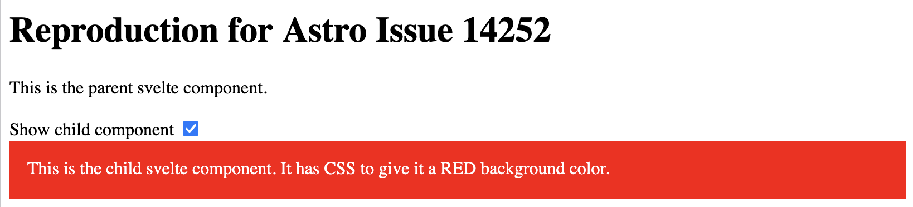
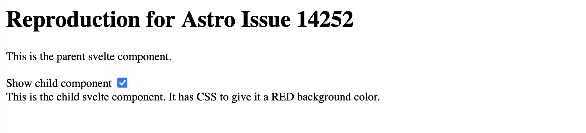

# Reproduction for Astro Issue 14252

The project was setup with `pnpm create astro@latest` and `pnpm astro add svelte`

- `src/pages/index.astro` is the single Astro page rendering a Svelte component with client:load
- `src/components/Parent.svelte` is the Svelte component rendered from Astro that is always present
- `src/components/Child.svelte` is the conditionally rendered child component

## Steps to Reproduce

Run in development mode to see the expected behaviour working correctly

```
pnpm dev
```

Clicking the checkbox renders the child component and its styles are applied correctly:



Run in production mode, to see the broken / incorrect behavour

```
pnpm preview
```

Clicking the checkbox renders the child component, none of its styles are applied:


